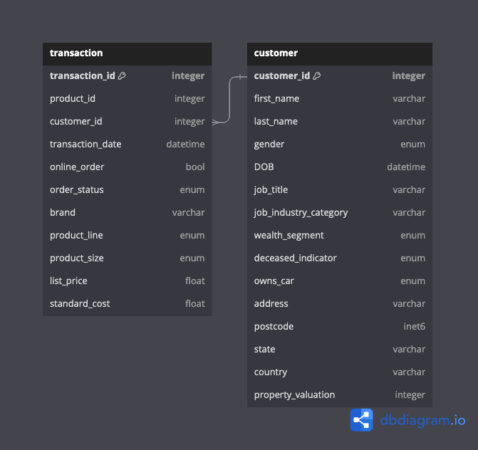
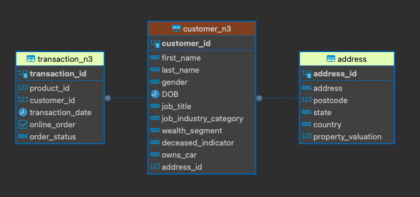
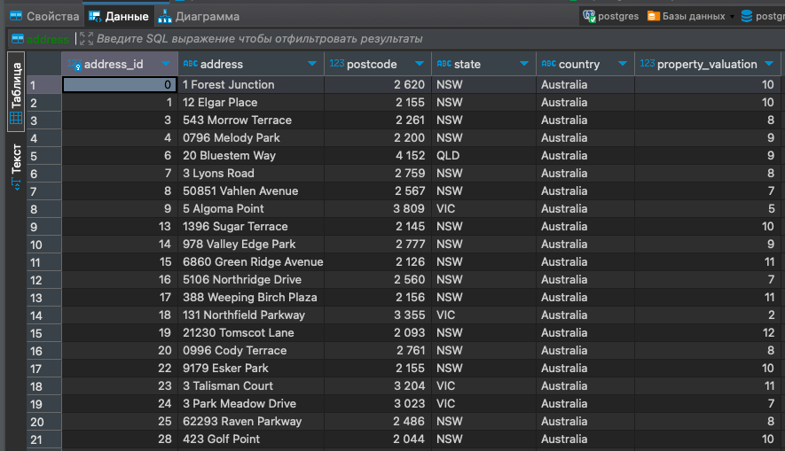
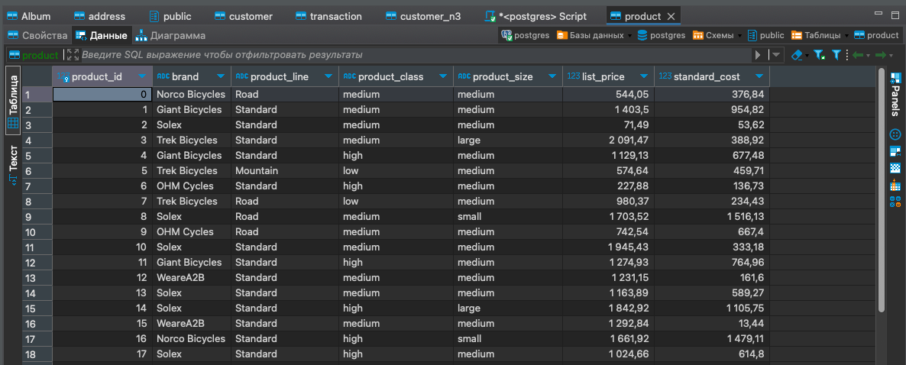
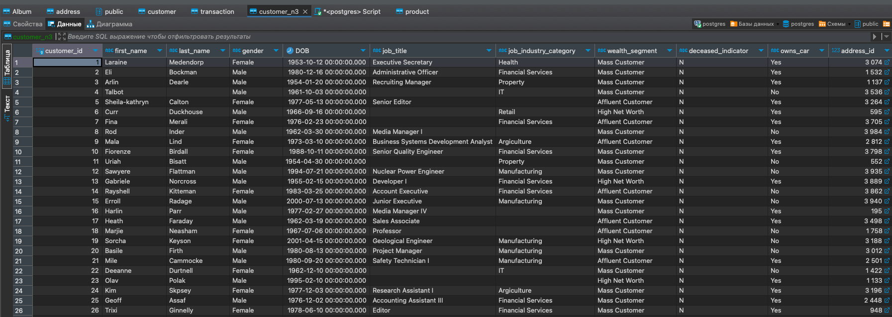
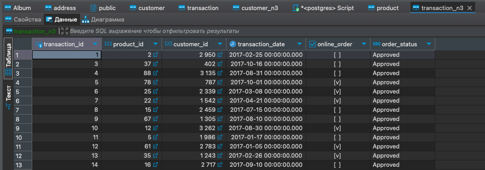

# Создание и нормализация базы данных (vo_HW)
### Тема домашней работы: Создание и нормализация базы данных.
### Цель домашней работы: Научиться создавать базы данных и нормализовать их. 

---
### Скрипты

Инициализация зависимостей
```bash
poetry install
```

Запуск Postgres:
```bash
docker run --name postgres  -p 5433:5432 -e POSTGRES_PASSWORD=postgres -d postgres
```

Запуск миграций:
```bash
poetry run alembic upgrade head
```

### Задание 1
> Продумать структуру базы данных и отрисовать в редакторе.
Отрисованная структура базы данных находится в файле `denormalized-tables.png`.


Создание Enum:
```postgresql
CREATE TYPE order_status AS ENUM ('Approved', 'Cancelled');

CREATE TYPE product_line AS ENUM ('Standard', 'Touring', 'Road', 'Mountain');

CREATE TYPE product_class AS ENUM ('medium', 'high', 'low');

CREATE TYPE product_size AS ENUM ('medium', 'large', 'small');

CREATE TYPE gender AS ENUM ('Male', 'Female');

CREATE TYPE wealth_segment AS ENUM ('Affluent Customer', 'High Net Worth', 'Mass Customer');

CREATE TYPE deceased_indicator AS ENUM ('N', 'Y');

CREATE TYPE owns_car AS ENUM ('Yes', 'No');
```

Также были созданы таблицы `customer` и `transaction` командами:
```postgresql
CREATE TABLE customer (
    customer_id SERIAL PRIMARY KEY,
    first_name VARCHAR NOT NULL,
    last_name VARCHAR,
    gender gender NOT NULL,
    DOB TIMESTAMP,
    job_title VARCHAR,
    job_industry_category VARCHAR,
    wealth_segment wealth_segment NOT NULL,
    deceased_indicator deceased_indicator NOT NULL,
    owns_car owns_car NOT NULL,
    address VARCHAR NOT NULL,
    postcode INTEGER NOT NULL,
    state VARCHAR NOT NULL,
    country VARCHAR NOT NULL,
    property_valuation INTEGER NOT NULL
);

CREATE TABLE transaction (
    transaction_id SERIAL PRIMARY KEY,
    product_id INTEGER NOT NULL,
    customer_id INTEGER REFERENCES customer(customer_id) NOT NULL,
    transaction_date TIMESTAMP NOT NULL,
    online_order BOOLEAN,
    order_status order_status NOT NULL,
    brand VARCHAR,
    product_line product_line,
    product_class product_class,
    product_size product_size,
    list_price DECIMAL NOT NULL,
    standard_cost DECIMAL
);
```

### Задание 2
> Нормализовать базу данных (1НФ — 3НФ), описав, 
к какой нормальной форме приводится таблица и почему таблица в этой нормальной форме изначально не находилась.

Для приведения таблицы customer к третьей нормальной форме (3НФ), рассмотрим каждый атрибут и его отношения с первичным ключом customer_id. Таблица уже находится в первой (1НФ) и второй нормальной форме (2НФ), так как каждый атрибут зависит от первичного ключа и нет частичных зависимостей.

Требования 3НФ:
1. Таблица должна быть во 2НФ.
2. Все атрибуты должны быть неприводимо зависимы только от первичного ключа, без транзитивных зависимостей.

Анализируя поля таблицы customer, мы видим, 
что большинство полей напрямую зависят от customer_id и уникальны для каждого клиента. 
Однако, можно заметить, что поля, связанные с адресом (address, postcode, state, country), 
могут быть выделены в отдельную таблицу, чтобы уменьшить 
дублирование данных для клиентов, живущих по одному и тому же адресу, 
и обеспечить лучшую поддержку изменений адресной информации.

Создадим таблицы `address` и `customer_n3`:
```postgresql
CREATE TABLE address (
    address_id SERIAL PRIMARY KEY,
    address VARCHAR NOT NULL,
    postcode INTEGER NOT NULL,
    state VARCHAR NOT NULL,
    country VARCHAR NOT NULL,
    property_valuation INTEGER NOT NULL
);

CREATE TABLE customer_n3 (
    customer_id INTEGER PRIMARY KEY,
    first_name VARCHAR NOT NULL,
    last_name VARCHAR,
    gender gender,
    DOB TIMESTAMP,
    job_title VARCHAR,
    job_industry_category VARCHAR,
    wealth_segment wealth_segment,
    deceased_indicator deceased_indicator,
    owns_car owns_car,
    address_id INTEGER NOT NULL,
    FOREIGN KEY (address_id) REFERENCES address(address_id)
);
```

По итогу получаем следующую картину:




Теперь приведем таблицу `transaction` к третьей нормальной форме (3НФ).
1. **Удаление транзитивных зависимостей**:
В таблице transaction, поля, такие как `brand`, `product_line`, `product_size`, `list_price`, и `standard_cost` 
могут быть зависимы не напрямую от `transaction_id`, а от `product_id`. 
Это означает, что эти поля лучше вынести в отдельную таблицу `product`.

Создадим таблицу `product`:
```postgresql
CREATE TABLE product (
  product_id integer PRIMARY KEY,
  brand varchar,
  product_line product_line,
  product_class product_class,
  product_size product_size,
  list_price float,
  standard_cost float
);
```
Теперь можем создать таблицу `transaction_n3`:
```postgresql
CREATE TABLE transaction_n3 (
    transaction_id INTEGER PRIMARY KEY,
    product_id INTEGER NOT NULL,
    customer_id INTEGER NOT NULL,
    transaction_date TIMESTAMP NOT NULL,
    online_order BOOLEAN,
    order_status order_status,
    FOREIGN KEY (product_id) REFERENCES product(product_id),
    FOREIGN KEY (customer_id) REFERENCES customer_n3(customer_id)
);
```

После нормализации получаем следующую диаграмму:


### Задание 3
> Создать все таблицы в DBeaver, указав первичные ключи к таблицам, правильные типы данных, 
> могут ли поля быть пустыми или нет (использовать команду CREATE TABLE).

Скрипт на создание всех таблиц:
```postgresql
BEGIN;
CREATE TYPE order_status AS ENUM ('Approved', 'Cancelled');

CREATE TYPE product_line AS ENUM ('Standard', 'Touring', 'Road', 'Mountain');

CREATE TYPE product_class AS ENUM ('medium', 'high', 'low');

CREATE TYPE product_size AS ENUM ('medium', 'large', 'small');

CREATE TYPE gender AS ENUM ('Male', 'Female');

CREATE TYPE wealth_segment AS ENUM ('Affluent Customer', 'High Net Worth', 'Mass Customer');

CREATE TYPE deceased_indicator AS ENUM ('N', 'Y');

CREATE TYPE owns_car AS ENUM ('Yes', 'No');

CREATE TABLE address (
    address_id SERIAL PRIMARY KEY,
    address VARCHAR NOT NULL,
    postcode INTEGER NOT NULL,
    state VARCHAR NOT NULL,
    country VARCHAR NOT NULL,
    property_valuation INTEGER NOT NULL
);

CREATE TABLE product (
  product_id integer PRIMARY KEY,
  brand varchar,
  product_line product_line,
  product_class product_class,
  product_size product_size,
  list_price float,
  standard_cost float
);

CREATE TABLE customer_n3 (
    customer_id INTEGER PRIMARY KEY,
    first_name VARCHAR NOT NULL,
    last_name VARCHAR,
    gender gender,
    DOB TIMESTAMP,
    job_title VARCHAR,
    job_industry_category VARCHAR,
    wealth_segment wealth_segment,
    deceased_indicator deceased_indicator,
    owns_car owns_car,
    address_id INTEGER NOT NULL,
    FOREIGN KEY (address_id) REFERENCES address(address_id)
);

CREATE TABLE transaction_n3 (
    transaction_id INTEGER PRIMARY KEY,
    product_id INTEGER NOT NULL,
    customer_id INTEGER NOT NULL,
    transaction_date TIMESTAMP NOT NULL,
    online_order BOOLEAN,
    order_status order_status,
    brand VARCHAR,
    product_line product_line,
    product_class product_class,
    product_size product_size,
    list_price DECIMAL NOT NULL,
    standard_cost DECIMAL,
    FOREIGN KEY (product_id) REFERENCES product(product_id),
    FOREIGN KEY (customer_id) REFERENCES customer_n3(customer_id)
);

COMMIT;
```

### Задание 4
> Загрузить данные в таблицы в соответствии с созданной структурой 
> (использовать команду INSERT INTO или загрузить файлы, используя возможности инструмента DBeaver; 
> в случае загрузки файлами приложить скрины, что данные действительно были залиты).

Команда для загрузки данных в `address`:
```postgresql
INSERT INTO address (address, postcode, state, country, property_valuation)
VALUES ('value1', value2, 'value3', 'value4', value5);
```


Команда для загрузки данных в `product`:
```postgresql
INSERT INTO product (product_id, brand, product_line, product_class, product_size, list_price, standard_cost)
VALUES (value1, 'value2', 'value3', 'value4', 'value5', value6, value7);
```


Команда для загрузки данных в `customer_n3`:
```postgresql
INSERT INTO customer_n3 (customer_id, first_name, last_name, gender, DOB, job_title, job_industry_category, wealth_segment, deceased_indicator, owns_car, address_id)
VALUES (value1, 'value2', 'value3', 'value4', 'value5', 'value6', 'value7', 'value8', 'value9', 'value10', value11);
```


Команда для загрузки данных в `transaction_n3`:
```postgresql
INSERT INTO transaction_n3 (transaction_id, product_id, customer_id, transaction_date, online_order, order_status, brand, product_line, product_class, product_size, list_price, standard_cost)
VALUES (value1, value2, value3, 'value4', value5, 'value6', 'value7', 'value8', 'value9', 'value10', value11, value12);
```
